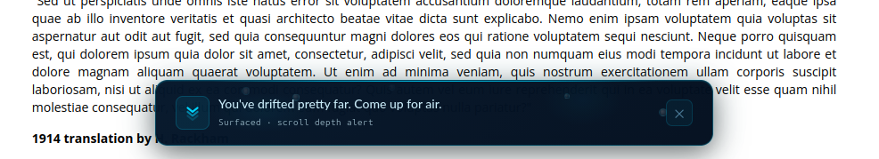
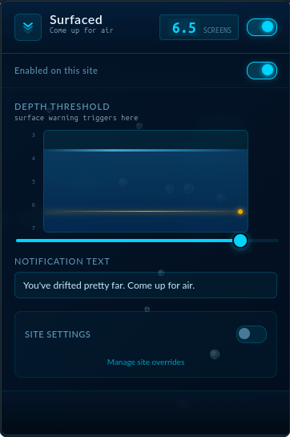

# Surfaced 🌊

**Come up for air.**

Surfaced is a Firefox extension that taps you on the shoulder when you've scrolled too far down a page. You set the threshold (say, 7 screens) and when you drift past it, a quiet notification appears at the bottom of the screen. A gentle reminder that you've been in the feed for a while.

Project source: https://github.com/piotrkacala/Surfaced

Please add bug reports and feature requests as GitHub Issues there.

---

## Why?

Infinite scroll is designed to be invisible. There's no bottom, no natural stopping point, no sense of how long you've been going. Surfaced puts a marker in the water so you always know how deep you've gone.

---

## What it looks like

---

## How to use it

**1. Install the extension**
Head to the Firefox Add-ons page and click **Add to Firefox**.

**2. Set your threshold**
Click the Surfaced icon in your toolbar. Use the depth gauge or type a number directly into the badge in the top-right of the popup. The default is **7 screens** (seven full screen-heights past the top). Settings save automatically as you adjust them.

**3. Browse normally**
Surfaced runs quietly in the background. When you scroll past your threshold on any page, a notification slides up from the bottom of the screen.

**4. Depth zones**
The further you scroll, the more urgent the notification becomes. There are three zones, each with a distinct color and message:

| Zone | Trigger | Color |
|---|---|---|
| Shallow | 1× your threshold | Cyan |
| Mid | 2× your threshold | Amber |
| Deep | 3× your threshold | Coral |

**5. Dismiss it**
Hit **✕** on the notification to dismiss it for that zone. Scroll even deeper and the next zone will trigger. Scroll back up above your threshold and the notification clears automatically.

**6. Watch your depth**
While scrolling, the toolbar icon badge shows exactly how many screens deep into the page you are.

---

## Settings

| Setting | What it does |
|---|---|
| **Enable** (top-right toggle) | Master on/off switch. Disables the extension entirely without uninstalling it. |
| **Enabled on this site** (below header) | Disables Surfaced just for the site you're currently on. |
| **Depth threshold** | How many screens deep before the first notification. Range: 7–14 screens. |
| **Notification text** | Customise the message shown at the shallow zone. The mid and deep zone messages are fixed. |
| **Site threshold override** | Set a different threshold for the current site, independent of the global setting. Toggle the switch in the "Site settings" section to enable it. |

---

## FAQ

**What's a "screen"?**
One screen equals one full height of your browser window. A threshold of 7 means you've scrolled down a distance equal to seven times the visible area.

**Will it slow down my browser?**
No. The scroll listener is throttled and passive, so it has no meaningful impact on performance.

**Does it track my browsing?**
Absolutely not. Surfaced has no network access and stores all settings locally on your device. Nothing ever leaves your browser.

**It didn't show up on a page I expected.**
Some pages use custom scroll containers or virtual lists (common in single-page apps). Surfaced uses a cumulative scroll distance approach to handle these better than a simple `scrollY` check, but some edge cases may still slip through.

**Is it available in other languages?**
Yes. English and Polish are supported natively, and the extension responds to your browser's language setting automatically.

**What happens when the page URL changes without a full reload?**
Surfaced detects single-page app navigation and resets its scroll tracking when you move to a new view, so the threshold applies fresh on each page you visit.

---

## License

GNU General Public License v3.0 (GPL-3.0).