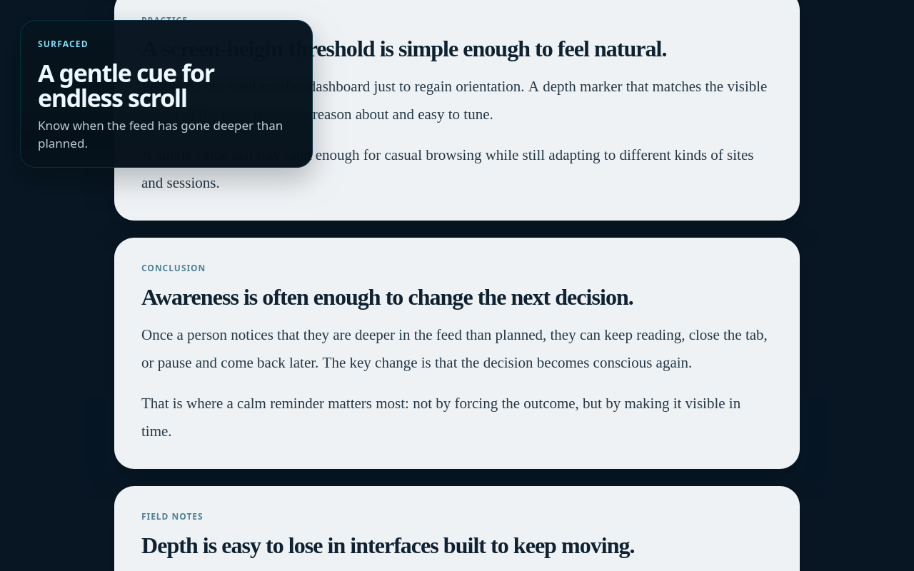
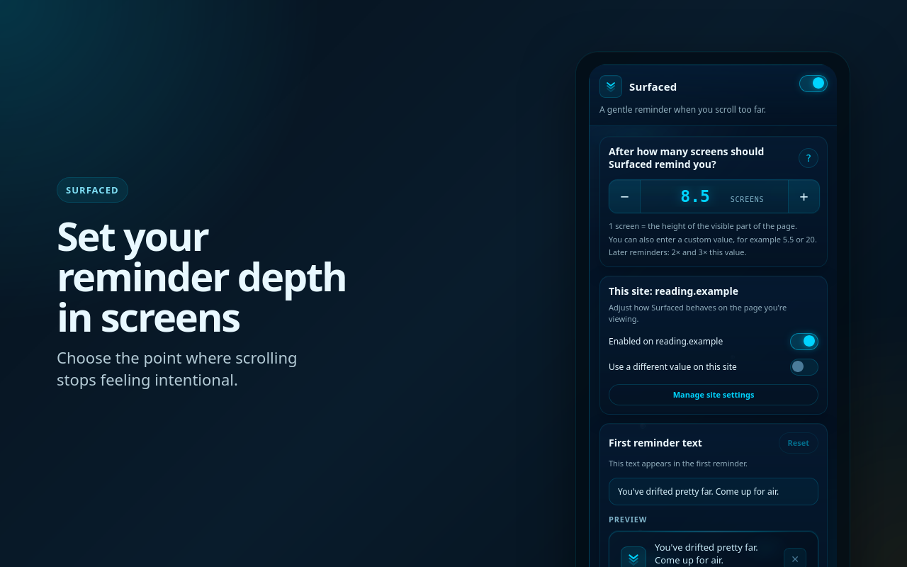
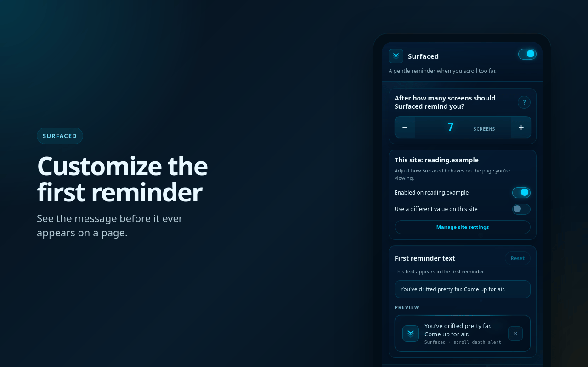
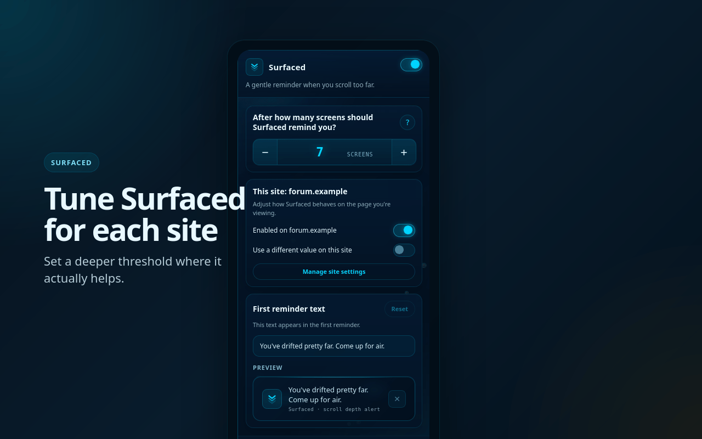
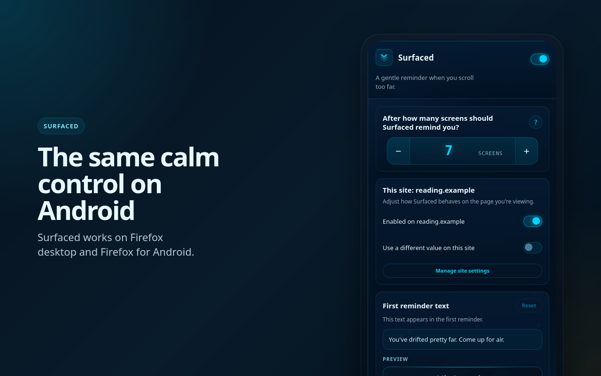

# Surfaced

**Come up for air.**

Surfaced is a browser extension for people who want a gentle reminder before endless scrolling turns into mindless drifting. It tracks cumulative scroll depth on long pages and feed-like interfaces, then shows a subtle notification when you've gone deeper than you meant to.

Works on Firefox for desktop, Firefox for Android, and Chrome desktop.

Surfaced keeps everything local in your browser. No analytics, no account, no remote services.

Firefox: install from Firefox Add-ons: https://addons.mozilla.org/firefox/addon/surfaced/

Chrome desktop: install from Chrome Web Store: https://chrome.google.com/webstore/detail/bpbidikjpaffmpcbincadomhbfnoaaem

Chrome desktop builds can also be generated from source with `./build.sh chrome`.

Project source: https://github.com/piotrkacala/Surfaced

Please add bug reports and feature requests as GitHub Issues there.

---

## Why Surfaced?

Infinite scroll removes natural stopping points. There is no bottom, no page break, and often no clear sense of how far you have gone. Surfaced adds that missing depth cue without blocking the page or breaking your flow.

It is meant to feel calm, not punitive: a quiet tap on the shoulder when you have drifted farther than intended.

---

## What it does

- Reminds you after a scroll-depth threshold you choose, measured in screens.
- Shows deeper follow-up reminders at `2×` and `3×` your chosen threshold.
- Lets you customize the first reminder text and preview it in the popup.
- Supports per-site disable and per-site threshold overrides.
- Shows your current depth in the toolbar badge once you are past your threshold.
- Tracks cumulative scroll distance, which works better on long feeds and many single-page apps than a simple `scrollY` check.

---

## What it looks like

The current accepted listing assets live in [`screenshots/`](screenshots/) and are regenerated from the capture tooling in [`tools/capture/`](tools/capture/).

**In-page reminder**

**Threshold control**

**Custom reminder preview**

**Per-site settings**

**Android popup**

---

## How it works

**1. Install the extension**  
Install Surfaced from [Firefox Add-ons](https://addons.mozilla.org/firefox/addon/surfaced/) on Firefox desktop or Android. On Chrome desktop, install it from the Chrome Web Store placeholder link above or build the separate Chrome package from source until the listing is published.

**2. Choose your threshold**  
Open the Surfaced popup and set the first reminder threshold in screens. The default is **7**. The UI is optimized around a recommended band of **7–14** screens, but custom positive values such as `5.5` or `20` are supported too.

**3. Browse normally**  
Surfaced runs quietly in the background. When you pass your threshold, a notification appears at the bottom of the page.

**4. Go deeper, get stronger reminders**  
There are three depth zones:

| Zone | Trigger | Color |
|---|---|---|
| Shallow | `1×` your threshold | Cyan |
| Mid | `2×` your threshold | Amber |
| Deep | `3×` your threshold | Coral |

**5. Dismiss or keep scrolling**  
Dismiss the current reminder with `✕`. If you scroll deeper, the next zone can still trigger. If you come back up below the threshold, the reminder clears and the cycle resets.

**6. Check the badge when you're deep**  
Once you are past your threshold, the toolbar badge shows your current depth as an integer number of screens.

---

## Settings overview

| Setting | What it does |
|---|---|
| **Enabled** | Master on/off switch for Surfaced. |
| **Reminder threshold** | Sets when the first reminder appears. Defaults to `7`. Supports any finite positive value. |
| **First reminder text** | Customizes the shallow-zone reminder. Mid and deep reminder text stays fixed. |
| **Enabled on this site** | Turns Surfaced off only for the current site. |
| **Use a different value on this site** | Applies a site-specific threshold override for the current host. |
| **Manage site settings** | Opens the saved per-site settings list so you can review or remove overrides. |

---

## Privacy

Surfaced is intentionally simple and local-first:

- no analytics
- no remote APIs
- no account
- no synced backend
- settings stored only in `browser.storage.local`

Nothing leaves your browser.

---

## FAQ

**What is a "screen"?**  
One screen equals one full height of the visible page area. A threshold of `7` means a scroll distance equal to seven visible screen-heights.

**Does Surfaced block websites or stop scrolling?**  
No. Surfaced is reminder-first, not blocker-first. It adds awareness without locking the interface.

**Will it slow down my browser?**  
No meaningful impact is expected. The scroll listener is passive and throttled.

**Why did it not show up on a page I expected?**  
Some sites use unusual virtual lists, custom scroll containers, or aggressive UI updates. Surfaced handles many of these better than a naive page-position check because it tracks cumulative scroll distance, but some edge cases may still slip through.

**What happens on single-page apps or URL changes without a full reload?**  
Surfaced detects many in-app navigations and resets scroll tracking when you move to a new view, so the threshold applies fresh on the next page state.

**Is it available in other languages?**  
Yes. English and Polish are supported, and Surfaced follows your browser language.

---

## License

GNU General Public License v3.0 (GPL-3.0).
